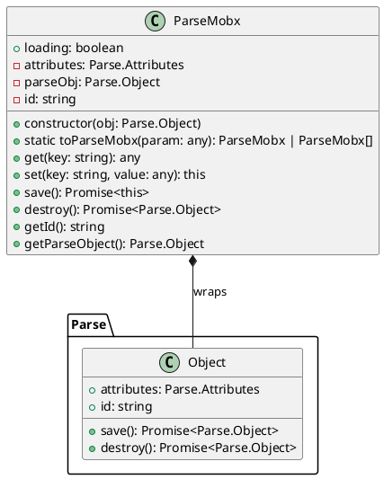
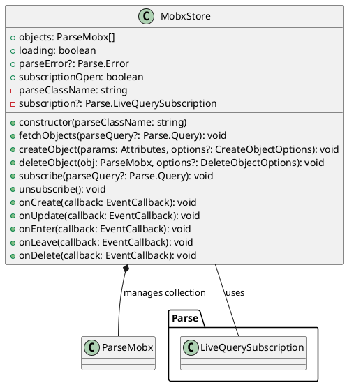
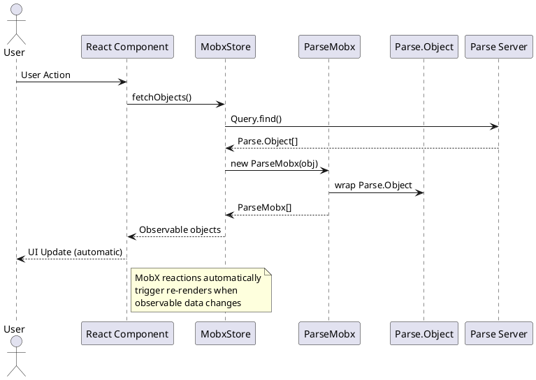
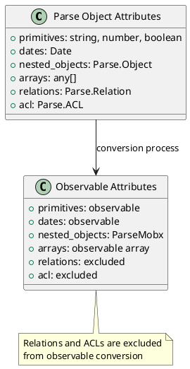
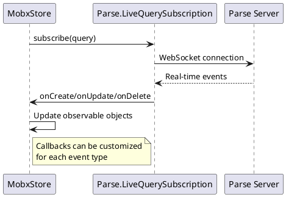

# Parse-MobX Library Architecture

## Overview

Parse-MobX is a TypeScript library that bridges Parse Platform objects with MobX observability, enabling reactive state management for Parse-based applications. It provides a seamless integration between Parse JS SDK and MobX, making Parse objects observable and reactive.

## Core Purpose

The library solves the challenge of making Parse objects reactive in MobX-based applications by:
- Wrapping Parse objects to make their attributes observable
- Providing automatic reactivity when Parse object properties change
- Maintaining synchronization between Parse objects and their observable counterparts
- Offering collection-level state management with MobxStore

## Architecture Components

### 1. ParseMobx Class

The core wrapper class that transforms Parse objects into MobX observable objects.



#### Key Features:
- **Observable Attributes**: All Parse object attributes become MobX observables
- **Loading State**: Built-in observable loading indicator during save operations  
- **Nested Object Support**: Automatically converts nested Parse objects to ParseMobx instances
- **Array Handling**: Maps arrays of Parse objects to arrays of ParseMobx objects
- **Relation Filtering**: Excludes Parse relations and ACLs from observable conversion

#### Constructor Logic:
1. Validates that Parse object is already saved (not new)
2. Creates observable attributes object
3. Iterates through Parse object attributes:
   - Converts nested Parse objects to ParseMobx instances
   - Maps arrays containing Parse objects
   - Filters out relations and ACLs
4. Makes attributes observable using `extendObservable`

### 2. MobxStore Class

A collection-level store for managing arrays of ParseMobx objects with built-in CRUD operations.



#### Key Features:
- **Observable Collection**: Maintains an observable array of ParseMobx objects
- **CRUD Operations**: Built-in create, read, update, delete functionality
- **Loading State**: Observable loading indicators for operations
- **Error Handling**: Observable error state for Parse operations
- **LiveQuery Support**: Real-time subscriptions with event callbacks
- **Asynchronous Operations**: All Parse operations wrapped in async/await patterns

### 3. Data Flow Architecture



### 4. Observable Attribute Management

The library handles different types of Parse attributes intelligently:



### 5. LiveQuery Integration

Real-time synchronization through Parse LiveQuery:



## Type System

### Core Types
- `EventCallback`: Function signature for LiveQuery event handlers
- `Attributes`: Generic key-value object for Parse attributes  
- `CreateObjectOptions`: Configuration for object creation
- `DeleteObjectOptions`: Configuration for object deletion

## Usage Patterns

### Basic Usage
```typescript
// Convert Parse object to observable
const parseObj = await new Parse.Query('Todo').first();
const observableTodo = new ParseMobx(parseObj);

// Use in MobX store
class TodoStore {
  @observable todos: ParseMobx[] = [];
  
  @action
  async fetchTodos() {
    const objects = await new Parse.Query('Todo').find();
    this.todos = objects.map(obj => new ParseMobx(obj));
  }
}
```

### Collection Management
```typescript
// Using MobxStore for collection management
const todoStore = new MobxStore('Todo');
todoStore.fetchObjects(); // Loads and makes observable
todoStore.createObject({ title: 'New Todo', completed: false });
```

## Benefits

1. **Reactive UI**: Automatic UI updates when Parse data changes
2. **Type Safety**: Full TypeScript support with proper typing
3. **Developer Experience**: Familiar MobX patterns for Parse operations
4. **Performance**: Efficient observable updates without manual state management
5. **Real-time**: Built-in LiveQuery support for real-time applications
6. **Error Handling**: Comprehensive error state management

## Dependencies

- **MobX**: State management and observability
- **Parse**: Parse Platform JavaScript SDK
- **TypeScript**: Type safety and development experience

## Limitations

- Only works with saved Parse objects (not new/unsaved objects)
- Parse Relations and ACLs are not made observable
- Requires Parse Server setup and configuration
